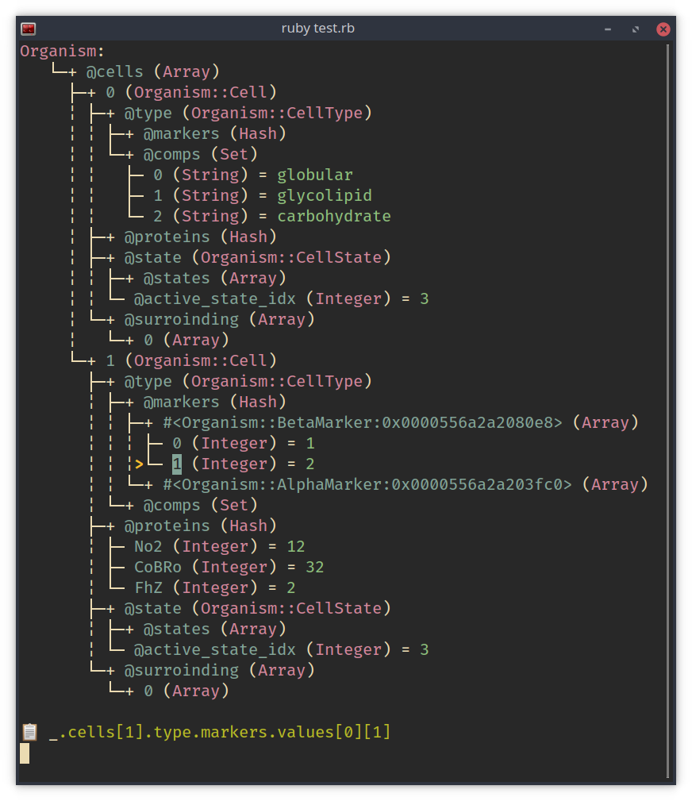

Ruby Object Viewer (rov)
------------------------



If you ever pry debugged large objects in Ruby on a terminal and got frustrated how hard to inspect large objects - other than printing them out and scrabble the details from pages of inspect-output - this might be for you.

This one file tool allows traversing objects bit by bit like a tree with a nice TUI and even helps showing a path of trails.

## Usage

It is one file so you can copy into a large project that doesn't allow live-loading gems (but at least you can gitignore this).

Once you loaded the file:

```bash
pry#> ROV[complex_object]
```

Keys:
- <kbd>🠕</kbd>: go up
- <kbd>🠗</kbd>: go down
- <kbd>🠔</kbd>: go to parent
- <kbd>🠖</kbd>: open to child
- <kbd>e</kbd>: close child
- <kbd>h</kbd>: go home (first node)
- <kbd>0</kbd> .. <kbd>9</kbd>: open N levels
- <kbd>q</kbd>: exit
